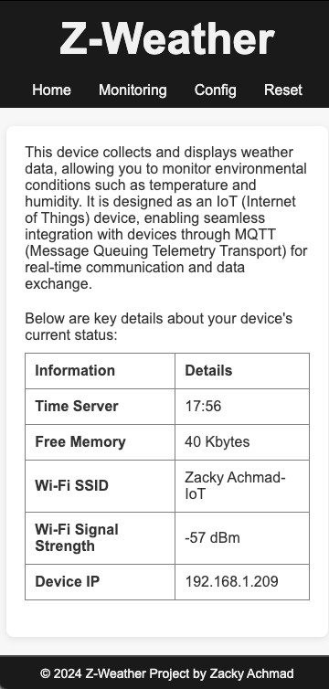
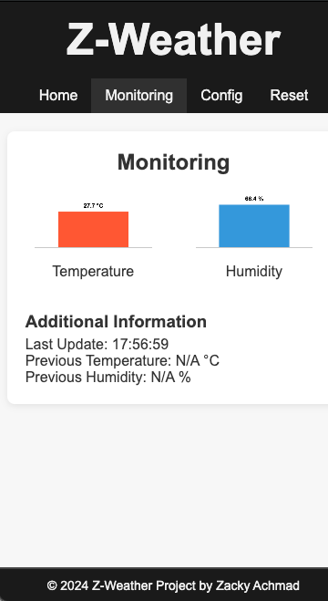
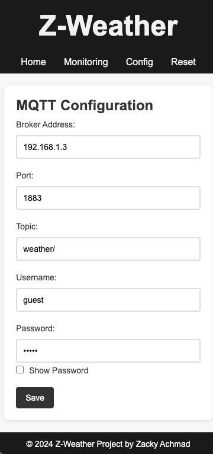
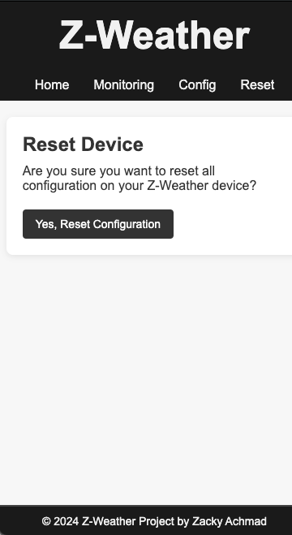

# 🌦️ Z-Weather

Z-Weather is a lightweight project designed to collect weather data such as temperature 🌡️ and humidity 💧 using an ESP8266 module and a DHT22 sensor. The collected data is transmitted in real-time using the MQTT (Message Queuing Telemetry Transport) protocol, a lightweight and efficient protocol designed for machine-to-machine communication. This project leverages RabbitMQ as the MQTT broker, ensuring reliable and efficient message routing from the ESP8266 to the server, which processes and monitors the incoming data.

In addition to MQTT, Z-Weather includes features like a WiFi Manager for easy network configuration, mDNS (Multicast DNS) for local device access via `z-weather.local`, and a Web UI for device control and monitoring. Settings are stored in EEPROM to ensure persistent configurations even after device reboot. This combination of features makes Z-Weather a powerful and easy-to-use weather monitoring tool, capable of providing real-time and reliable weather data, making it an excellent solution for both personal and professional weather tracking needs.

---

## 📋 Table of Contents
1. [Demo Website](#🌐-demo-website)
2. [Key Features](#✨-key-features)
3. [Libraries and Dependencies](#📚-libraries-and-dependencies)
4. [Components List](#🔧-components-list)
5. [Pinout](#🔌-pinout)
6. [How to Use](#🚀-how-to-use)
   - [Installation](#installation)
   - [Initial Setup](#initial-setup)
   - [Configure WiFi](#configure-wifi)
   - [Access the Web UI](#access-the-web-ui)
   - [Configure MQTT](#configure-mqtt)
   - [Monitor and Reset](#monitor-and-reset)
7. [Important Notes](#📋-important-notes)
8. [License](#📄-license)

---

## 🌐 Demo Website

Z-Weather is more than just a weather data collector — it's an intuitive and interactive tool that brings the weather to your fingertips!

  
Curious about how it works? Here's a quick peek at the web interface:

  

    

      <h4>Home Page</h4>
      
    

    

      <h4>Monitoring Page</h4>
      
    

    

      <h4>Configuration Page</h4>
      
    

    

      <h4>Reset Page</h4>
      
    

  

---

## ✨ Key Features

- **WiFi Configuration Manager**: Easily configure WiFi credentials via a dedicated Web UI interface.
- **mDNS Integration**: Seamless device access using a local domain, e.g., `z-weather.local`.
- **Persistent Settings Storage**: MQTT configurations are saved to EEPROM, ensuring stability across reboots.
- **Dynamic Web UI**: Access to device monitoring, MQTT configuration, and resetting settings.
- **Real-Time MQTT Support**: Automatically sends weather data to an MQTT server for efficient integration.

---

## 📚 Libraries and Dependencies

The project utilizes the following libraries and their respective dependencies:

- [ESP8266WiFi](https://github.com/esp8266/Arduino) - Core library for ESP8266 WiFi functionality.
- [WiFiManager](https://github.com/tzapu/WiFiManager) - Simplifies WiFi network selection and credential storage.
  - Dependency: ESP8266 core libraries.
- [ESP8266WebServer](https://github.com/esp8266/Arduino) - HTTP server for Web UI implementation.
- [ESP8266mDNS](https://github.com/esp8266/Arduino) - Enables mDNS for easy domain-based access.
- [EEPROM](https://github.com/esp8266/Arduino) - Used for storing MQTT configuration.
- [PubSubClient](https://github.com/knolleary/pubsubclient) - MQTT client library for connecting to MQTT brokers.
- [DHT sensor library](https://github.com/adafruit/DHT-sensor-library) - Library for interacting with DHT22 temperature and humidity sensor.
  - Dependency: [Adafruit Unified Sensor Driver](https://github.com/adafruit/Adafruit_Sensor).

---

## 🔧 Components List

1. **ESP8266** - WiFi module to connect the device to a network and send data.
2. **DHT22** - Temperature and humidity sensor to measure weather data.

---

## 🔌 Pinout

Here’s the pinout for connecting the **ESP8266** to the **DHT22** sensor:

| **ESP8266 Pin** | **DHT22 Pin** | **Description**              |
| --------------- | ------------- | ---------------------------- |
| GND             | GND           | Ground connection            |
| 3.3V            | VCC           | Power supply (3.3V)          |
| D4 (GPIO 2)     | Data          | Data pin for sensor readings |

---

## 🚀 How to Use

### Installation

1. Connect the ESP8266 module to your computer.
2. Install the ESP8266 board package in the Arduino IDE:
   - Open **File > Preferences** and add `http://arduino.esp8266.com/stable/package_esp8266com_index.json` to the **Additional Board Manager URLs**.
   - Go to **Tools > Board > Boards Manager**, search for `ESP8266`, and click **Install**.
3. Select the **Generic ESP8266 Module** board from the **Tools > Board** menu.
4. Install the required libraries listed in the **Libraries and Dependencies** section.
5. Open the project code in Arduino IDE and upload it to the ESP8266 module.
6. Once uploaded, the device is ready to use.

### Initial Setup

1. Power on the ESP8266 device running the Z-Weather firmware.
2. The device will create a default WiFi network:
   - **SSID**: `Z-Weather`
   - **Password**: `zweather`

### Configure WiFi

1. Connect your device to the default `Z-Weather` WiFi network.
2. Open a browser and navigate to `192.168.4.1` to access the configuration page.
3. Select the desired WiFi network, enter the password if required, and save the settings.
4. Upon successful connection, the default WiFi network will disappear, and the device will connect to the configured network.

### Access the Web UI

1. Ensure your device is on the same WiFi network as the ESP8266.
2. Access the device using the domain: `z-weather.local`.

### Configure MQTT

1. Open the Web UI by navigating to `z-weather.local/config`.
2. Enter the MQTT server details, including server address, username, and password (if applicable).
3. Save the configuration to start sending weather data to the MQTT server.

### Monitor and Reset

- Use the Web UI to monitor device status and sensor data.
- Reset configurations from the Web UI if necessary.

---

## 📋 Important Notes

- The domain `z-weather.local` can only be accessed if your device supports **mDNS** and is connected to the same WiFi network as the ESP8266.
- Ensure that your MQTT server is operational and ready to receive data from Z-Weather.

---

## 📄 License

This project is licensed under the [MIT License](LICENSE).

---

Enjoy using Z-Weather! 🌤️ If you have any questions or issues, don’t hesitate to contact us through this GitHub repository.
